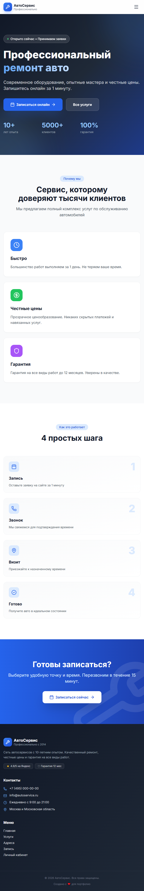
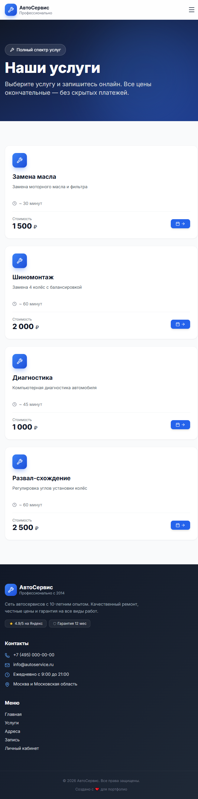
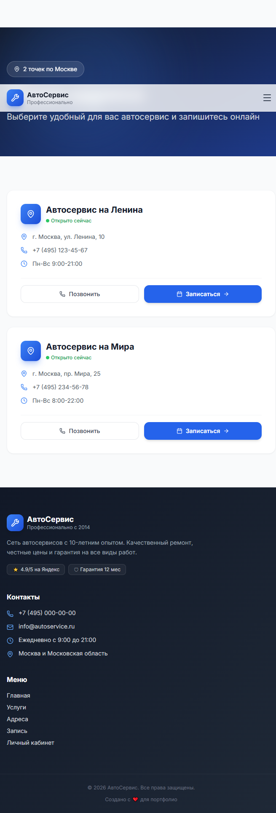
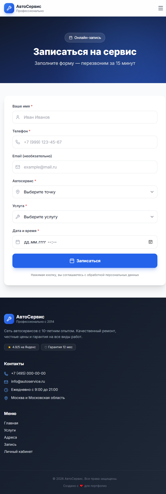
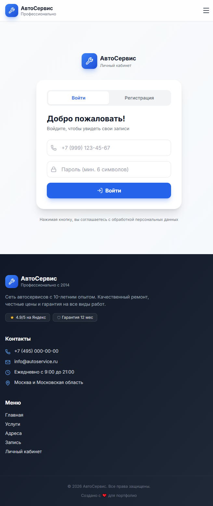
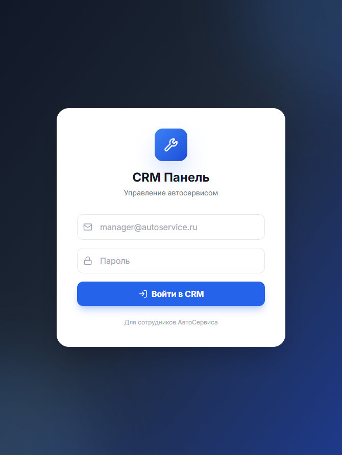
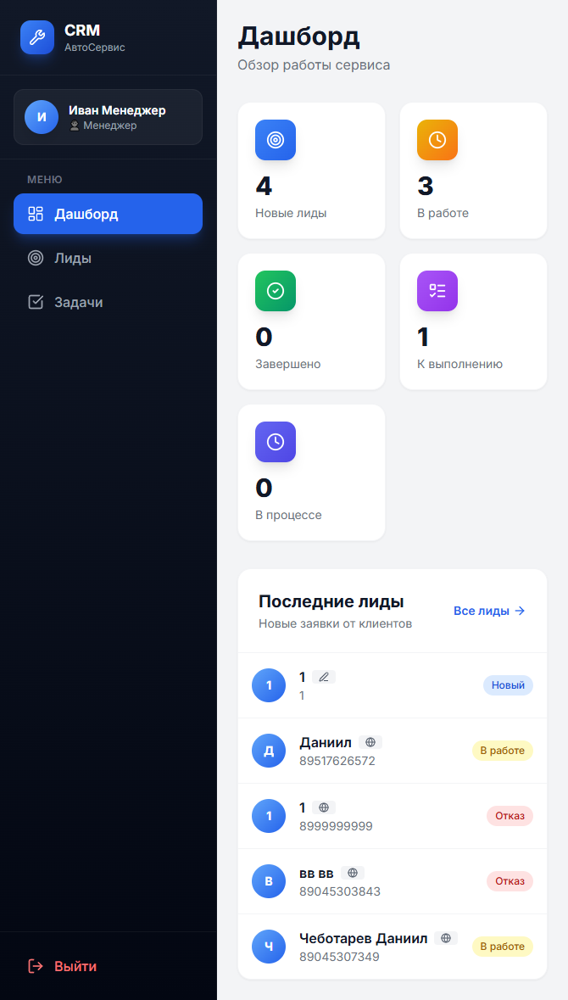
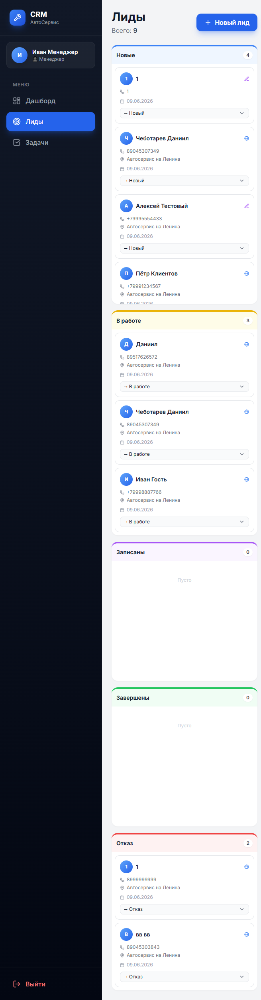
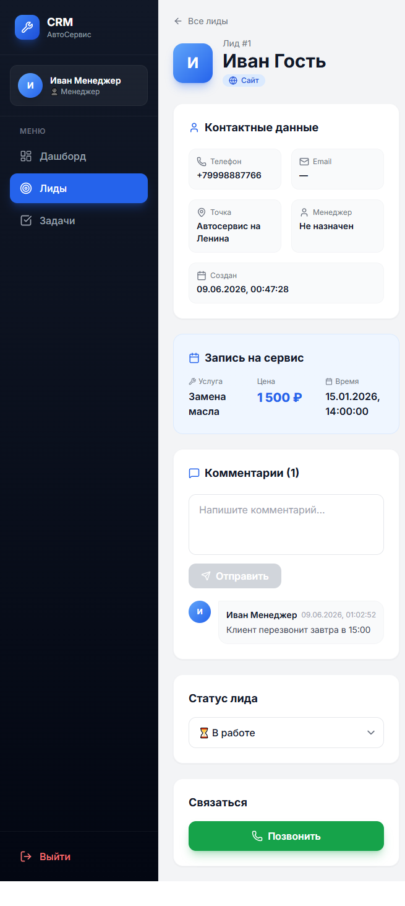

# 🔧 АвтоСервис — Сайт + CRM

Full-stack веб-приложение для сети автосервисов: публичный сайт с онлайн-записью и полноценная CRM-панель для менеджеров.

    

## 📋 Описание
> Учебный проект для портфолио. Полностью функциональный full-stack: 
> от формы записи на сайте до Kanban-доски в CRM.
Проект состоит из двух частей:

### 🌐 Публичный сайт
- Главная страница с презентацией компании
- Каталог услуг с ценами
- Список адресов автосервисов
- Форма онлайн-записи
- Личный кабинет клиента с историей записей

### 🔧 CRM-панель
- Авторизация менеджеров с JWT
- Dashboard со статистикой
- Kanban-доска лидов (5 статусов)
- Карточки лидов с комментариями
- Управление задачами с дедлайнами
- Роли: администратор / менеджер
## ✨ Функционал

### Для клиентов
- ✅ Просмотр услуг с ценами и временем выполнения
- ✅ Просмотр всех адресов автосервиса
- ✅ Онлайн-запись с выбором точки, услуги и времени
- ✅ Регистрация и авторизация
- ✅ Личный кабинет с историей записей

### Для менеджеров (CRM)
- ✅ Авторизация с JWT-токенами
- ✅ Dashboard со статистикой по лидам и задачам
- ✅ Управление лидами через Kanban-доску (drag&drop через select)
- ✅ Карточка лида с полной информацией, комментариями и историей
- ✅ Автоматическое создание лида при онлайн-записи
- ✅ Управление задачами с дедлайнами
- ✅ Подсветка просроченных задач
- ✅ Разграничение прав (admin / manager)
## 🛠 Стек технологий

**Frontend:**
- React 19 + TypeScript
- Tailwind CSS 3
- React Router 7
- Axios
- Lucide React (иконки)

**Backend:**
- Node.js + Express
- TypeScript
- PostgreSQL
- JWT (jsonwebtoken)
- bcryptjs (хеширование паролей)
## 📸 Скриншоты

### 🌐 Публичный сайт

**Главная страница**

**Каталог услуг**

**Список адресов**

**Форма онлайн-записи**

**Личный кабинет клиента**

### 🔧 CRM-панель

**Вход для менеджеров**

**Dashboard**

**Kanban-доска лидов**

**Карточка лида**

## 🚀 Запуск проекта

### Требования
- Node.js 18+
- PostgreSQL 14+

### 1. Клонирование
\`\`\`bash
git clone https://github.com/dArkSOulsSq/autoservice.git
cd autoservice
\`\`\`

### 2. База данных
\`\`\`bash
# Создай базу autoservice в PostgreSQL
# Затем выполни SQL из database.sql
\`\`\`

### 3. Backend
\`\`\`bash
cd server
npm install
cp .env.example .env
# Отредактируй .env (пароль БД и JWT_SECRET)
npm run dev
\`\`\`

Сервер запустится на `http://localhost:5000`

### 4. Frontend
\`\`\`bash
cd client
npm install
npm run dev
\`\`\`

Сайт откроется на `http://localhost:5173`

## 📁 Структура проекта

\`\`\`
autoservice/
├── client/              # React-приложение
│   ├── src/
│   │   ├── api/         # axios + методы API
│   │   ├── components/  # Переиспользуемые компоненты
│   │   ├── context/     # AuthContext, CrmAuthContext
│   │   ├── pages/       # Страницы сайта и CRM
│   │   └── types/       # TypeScript типы
│   └── package.json
│
├── server/              # Node.js Express API
│   ├── src/
│   │   ├── controllers/ # Бизнес-логика
│   │   ├── middleware/  # JWT, проверка ролей
│   │   ├── routes/      # API маршруты
│   │   ├── db/          # Подключение к PostgreSQL
│   │   └── index.ts     # Точка входа
│   └── package.json
│
├── database.sql         # SQL для создания БД
└── README.md
\`\`\`

## 🔌 API Endpoints

### Авторизация
- `POST /api/auth/register` — регистрация менеджера
- `POST /api/auth/login` — вход
- `GET /api/auth/me` — текущий пользователь

### Клиенты сайта
- `POST /api/clients/register` — регистрация клиента
- `POST /api/clients/login` — вход клиента
- `GET /api/clients/me/bookings` — мои записи

### Бронирования
- `POST /api/bookings` — создать запись

### Лиды (CRM)
- `GET /api/leads` — список лидов с фильтрами
- `GET /api/leads/:id` — лид с комментариями
- `POST /api/leads` — создать
- `PATCH /api/leads/:id/status` — обновить статус
- `POST /api/leads/:id/comments` — добавить комментарий

### Задачи (CRM)
- `GET /api/tasks?my=true` — список задач
- `POST /api/tasks` — создать
- `PATCH /api/tasks/:id/status` — изменить статус
- `DELETE /api/tasks/:id` — удалить

## 👤 Автор

- 💬 Telegram: [@danidmit](https://t.me/danidmit)
- 💻 GitHub: [@dArkSOulsSq](https://github.com/dArkSOulsSq)

## 📄 Лицензия

MIT
## 💭 От автора

Это мой первый большой full-stack проект. Делал с нуля, разбирался с TypeScript, JWT, 
PostgreSQL JOIN-запросами и React Context. Если есть вопросы или хочешь дать обратную 
связь - пиши в Telegram!